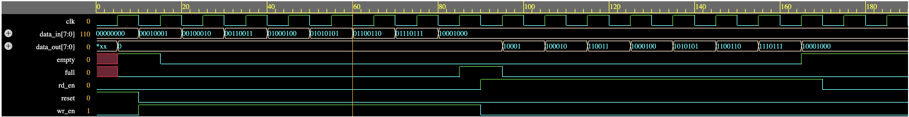

**Synchronous FIFO Design in Verilog HDL**

**Overview**
This project implements a parameterized synchronous First-In First-Out (FIFO) memory using Verilog HDL. The FIFO enables reliable data buffering between modules operating under the same clock and supports configurable data width and memory depth.

**Features**
Parameterized data width and FIFO depth
Circular buffer implementation
Synchronous read and write operations
Read and write pointer management
Full and Empty status flag generation
Occupancy tracking using a counter
Functional verification using a Verilog testbench

**FIFO Architecture**
The FIFO stores incoming data in a memory array while maintaining separate read and write pointers. Data is written at the write pointer location and read from the read pointer location in the same order it was received (FIFO principle). A counter tracks the number of stored elements to determine the Full and Empty conditions.

**Simulation Results**
The design was verified using the following test cases:
Reset operation
Sequential write operations
Sequential read operations
Full condition detection
Empty condition detection
Pointer wraparound
Simultaneous read and write operations

**Waveform**

**Tools Used**
Verilog HDL
EDA Playground
Icarus Verilog

**Future Improvements**
Almost Full and Almost Empty flags
Overflow and Underflow detection
Asynchronous FIFO implementation
SystemVerilog assertions for verification
